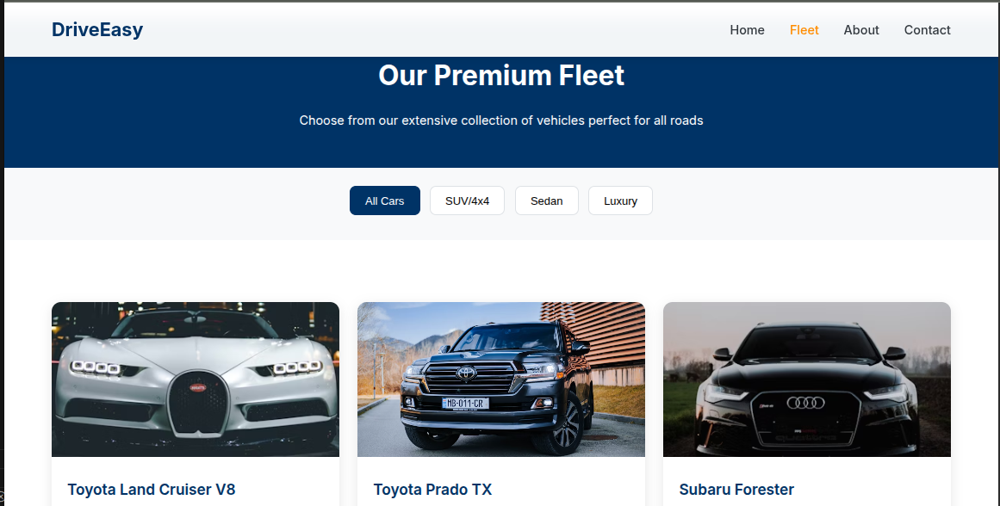

# DriveEasy Kenya - Car Rental Web Application

<!-- Tech Stack Badges -->
[](https://developer.mozilla.org/docs/Web/HTML)
[](https://developer.mozilla.org/docs/Web/CSS)
[](https://developer.mozilla.org/docs/Web/JavaScript)
[](https://JMakoti.github.io/plp-webtechnologies-classroom-july2025-july-2025-final-project-and-deployment-Final-Project-and-Depl/)
[](LICENSE)


## Overview
DriveEasy Kenya is a modern, responsive car rental web application designed for the Kenyan market. It allows users to browse a premium fleet, learn about the company, and book vehicles online. The project demonstrates best practices in HTML5, CSS3, and JavaScript, with a focus on accessibility and user experience.

## Features
- Multipage layout: Home, Fleet, About, Contact
- Responsive design for all devices
- Accessible navigation and forms
- Car filtering and booking form
- Modern UI with Kenyan branding
- Semantic HTML5 and ARIA roles for accessibility
- Mobile-friendly navigation and booking
- Form validation and user feedback

## Screenshots
<!-- Add screenshots of your site here -->



## Tech Stack
- HTML5
- CSS3 (Flexbox, Grid, custom properties)
- JavaScript (ES6+)
- [Unsplash](https://unsplash.com/) for demo car images

## Project Structure
```
index.html
about.html
fleet.html
contact.html
css/
   styles.css
js/
   main.js
images/
   ...
```

## Getting Started
1. **Clone the repository:**
    ```bash
    git clone https://github.com/JMakoti/plp-webtechnologies-classroom-july2025-july-2025-final-project-and-deployment-Final-Project-and-Depl.git
    cd plp-webtechnologies-classroom-july2025-july-2025-final-project-and-deployment-Final-Project-and-Depl
    ```
2. **Open `index.html` in your browser** or use a local server for best results.

## Usage
- Browse the fleet and filter by car type
- Learn about the company and its values
- Book a car using the contact form (demo only, no backend)
- Responsive and accessible on all devices

## Deployment
This project can be deployed using GitHub Pages:
- The live site will be available at:
   [https://JMakoti.github.io/plp-webtechnologies-classroom-july2025-july-2025-final-project-and-deployment-Final-Project-and-Depl/](https://JMakoti.github.io/plp-webtechnologies-classroom-july2025-july-2025-final-project-and-deployment-Final-Project-and-Depl/)
- To deploy, push your changes to the `main` branch and enable GitHub Pages in the repository settings (set the source to the `/ (root)` folder).

## Accessibility
- Semantic HTML5 elements
- ARIA labels and roles for navigation
- Sufficient color contrast
- Keyboard navigable menus and forms
- Alt text for all images

## Contributing
Contributions are welcome! Please fork the repository and submit a pull request for review.

## Credits
- [Unsplash](https://unsplash.com/) for car and office images
- [Shields.io](https://shields.io/) for badges
- PLP Web Technologies Classroom, July 2025

## Badges
[](https://JMakoti.github.io/plp-webtechnologies-classroom-july2025-july-2025-final-project-and-deployment-Final-Project-and-Depl/)

## License
This project is licensed under the MIT License.

---
*Developed for the PLP Web Technologies Classroom, July 2025.*
